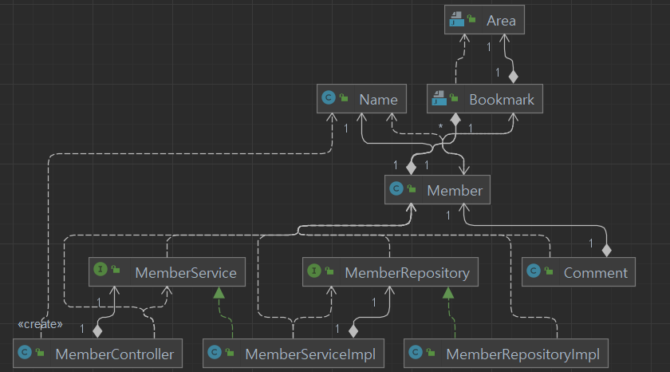

# HappyHouse

---

# 개요

전국의 아파트 거래 정보를 날짜, 지역 별로 조회할 수 있는 웹 페이지

거래정보 조회 외에도 회원가입, 로그인, 지역 북마크 추가, 아파트 위치 시각화, 마커 및 인포윈도우 표시 등의 기능을 구현.  

---

# 역할 분배 및 기여자

## Front-End

**강성엽**, **이수은**

- HTML5, CSS3, JavaScript, BootStrap4

## Back-End

**임승민**

- Java, Spring Framework, JPA, H2  

---

# 기능 구현

## Front-End

### 1. 초기화면


로그인 및 회원가입이 가능

2022년 2월을 초기 날짜로 지정

**Geolocation**과 연동하여 현재 위치에 지도를 위치시키고 마커를 표시

**지역 북마크 추가 버튼**이 로그인 전이므로 비활성화  

### 2. 로그인페이지


별도의 HTML로 구현

Back-End와 연동하여 **실제 로그인이 가능함**.  

### 3. 회원가입 페이지


별도의 HTML로 구현

**비밀번호 확인**에 대해 유효성 검증 구현

Back-End와 연동하여 **실제 회원가입이 가능**   

### 4. 로그인 이후


로그인 이후의 메인페이지를 별도 HTML로 구현

**북마크 추가 버튼** 활성화

**로그인, 회원가입 버튼 비활성화** 및 계정 관리 버튼 활성화   

### 5. 지역 검색


로딩과 동시에 **시/도** 정보를 로딩해 option으로 추가


**시/군/구** 에 대해 **더블 셀렉트** 기능을 구현: **AJAX 활용**

수원시 영통구, 성남시 분당구, 청주시 흥덕구와 같은 **예외 케이스에 대한 대응** 완료

**읍/면/동** 검색 기능은 의도적으로 배제

- 공공데이터의 **법정동** 카테고리는 실생활에서 거의 사용되지 않는 legacy에 가까움. 실제로는 **행정동**을 주로 사용하고 있으나 데이터에 포함되지 않음.

  - 예시로, 관악구는 행정동만 21개이지만 법정동은 단 3개

    반대로 종로구는 행정동이 17개이지만 법정동은 무려 87개

- 부동산 매물을 탐색하는 사용자의 입장에서 동 단위는 중요하지 않고, 검색 절차만 복잡하게 만들 뿐이라고 판단    

### 6. 북마크 기능


현재 선택한 지역을 **북마크로 추가**할 수 있음

- **DB와 연동**하여 사용자와 북마크 데이터를 연결함

이미 추가한 지역에 대해서는 북마크로 등록 불가하도록 **유효성 검증**

북마크를 통한 조회 및 북마크 삭제 기능 구현   

### 7. 상세정보 조회 및 지도 기능


지역 선택 완료 시, 

- 좌측 상단에 선택된 지역의 이름을 **지도의 제목**으로 출력

- 해당 시기 해당 지역의 **매물 간략정보**를 table 형식으로 조회

table의 **각 행을 클릭**할 시,

- 선택된 행임을 나타낼 수 있도록 행의 **css를 변경**하고

- 우측 하단에 해당 거래에 대한 **상세 정보를 출력**하며

- **지도**가 해당 매물의 위치로 이동하면서 마커를 생성

table의 행은 **다중 선택이 가능**하고, 마커도 다중으로 생성 가능


선택된 행을 다시 클릭할 시, **선택이 해제**됐음을 시각적으로 구현

- 지도에 표시된 **마커도 함께 제거**하도록 구현


같은 **시/도** 내에서는 **시/군/구**를 switch해도 지도 상의 마커를 유지하도록 의도

- **매물 탐색이 보통 시/도 단위**로 이루어짐을 감안함.

**시/도**를 switch할 시 선택 정보 및 지도 상 마커가 전부 초기화


지도 상의 마커를 클릭할 시, 해당 매물의 이름을 **인포윈도우**로 구현

- **removable**로 구현

**마커 전부 삭제** 버튼 클릭 시 모든 마커가 초기화됨   

### 8. 기간 검색


우측 상단의 버튼으로 **검색 기간을 변경**할 수 있음

- **AJAX**로 구현하여, 지역 선택이 완료된 이후라면 즉시 검색이 이루어짐

기간 변경 시 세부 정보 선택 여부나 마커는 **모두 초기화**   

----

## Back-End

개발하며 신경 쓴 부분들에 대해 기술합니다.

의존관계

### 1. 클린 코드

보다 깔끔한 코드를 작성하기 위하여 신경을 많이 썼습니다.

**lombok과 Spring 의 애노테이션 설계**

lombok과 Spring은 많은 어노테이션을 지원합니다. 자주 쓰이는 애노테이션들을 활용하여 이해하기 쉽고 지저분한 코드를 많이 생략할 수 있습니다.

- `@Data`, `@Getter`, `@Service`, `@RequiredArgsConstructor` 등등

예시코드

**MemberServiceImpl**

```java
@Service
@RequiredArgsConstructor
@Transactional(readOnly = true)
public class MemberServiceImpl implements MemberService {
      private final MemberRepository memberRepository;

      @Transactional
    @Override
    public Long join(Member member) {
        memberRepository.save(member);
        return member.getId();
    }

    ...
}
```

 final 변수는 생성자로 주입하거나 초기화로 주입할 수 있습니다. 생성자 주입을 위해 `@RequiredArgsConstructor` 를 사용하여 생성자 부분의 코드가 사라짐으로써 보다 깔끔한 코드가 탄생됩니다.

**LoginForm**

```java
@Data
public class LoginForm {

    @Email
    @NotEmpty
    private String email;

    @NotEmpty
    private String password;
}
```

`@Data` 애노테이션을 통해 getter와 setter를 코드에 집어넣지 않음으로 정말 깔끔한 코드가 완성됩니다.

**빌더 패턴**

Member 객체 같은경우 파라미터로 받아야 할 값들이 많습니다. 무작정 파라미터를 늘려 생성자로 확장하면 나중에 확장성도 떨어질 뿐더러 객체를 생성할 때 실수여지도 늘어나고, 가독성도 떨어집니다. 이를 방지하기 위해 파라미터가 조금 많아지는 부분은 빌더패턴을 적용하였습니다.

예시 코드

**Member**

```java
@Entity
@Getter
@NoArgsConstructor(access = PROTECTED)
public class Member {

    ...

    private Member(Builder builder) {
        name = builder.name;
        email = builder.email;
        password = builder.password;
    }

    @Override
    public String toString() {
        return "Member{" + "name='" + this.getEmail() + '\'' + '}';
    }

    public static class Builder {
        private Name name;
        private String email;
        private String password;

        public Builder name(Name name){
            this.name = name;
            return this;
        }

        public Builder email(String email) {
            this.email = email;
            return this;
        }

        public Builder password(String password) {
            this.password = password;
            return this;
        }

        public Member build() {
            return new Member(this);
        }
    }
}
```

이러한 빌더 패턴을 적용하면 멤버 객체를 생성할 때 다음과 같이 코드를 짤 수 있습니다.

```java
Member member = new Member.Builder()
  .name(name)
  .email(form.getEmail())
  .password(form.getPassword())
  .build();
```

그러면 파라미터마다 어떤 값을 넣어야 할지 명확하여 실수할 여지도 줄어들고, 파라미터가 늘어나도 확장성도 늘어납니다.

**객체와 메서드는 한가지 책임**

클래스도, 메서드도 한가지 책임을 담당하도록 최대한 설계하였습니다. 아직 리팩터링해야할 부분이 너무 많지만 그 중 일부만 예를 들어 보이겠습니다.

예시코드

```java
@PostMapping("/login")
public String login(@Validated @ModelAttribute("loginForm") LoginForm form,
                    BindingResult bindingResult,
                    HttpServletRequest request) {

  loginValidator.validate(form, bindingResult);

  if (bindingResult.hasErrors()) {
    return "member/login";
  }

  loginService.login(request, form.getEmail());
  return "redirect:/";
}
```

컨트롤러의 일부입니다. 외부에서 데이터가 컨트롤러로 넘어오면 먼저 데이터 검증을 마칩니다. 검증은 컨트롤러에게 역할을 맡기면 부담이 될 수 있기에, 역할을 검증기 객체에 넘깁니다. 그리고 검증이 된 데이터는 서비스에 데이터를 넘기고 뷰에 매핑하는 작업을 진행합니다. 검증기는 검증만, 컨트롤러는 컨트롤만, 서비스는 서비스만 진행됩니다.

또한 메서드들은 들여쓰기가 2줄이상 넘어가는 코드가 없어 이해하기가 더욱 쉽습니다.


**자바 8 스킬**

자바 8에는 lambda와 stream등 여러 스킬들이 나와 사용하면 코드를 클린하게 짤 수 있습니다. 그리고 추가된 메서드들을 활용하면 새로운 메서드를 짜지 않고 짤 수 있어 클린하며, 더 효율적인 코드로 구상이 가능합니다.

예시코드

```java
@Override
public Optional<Member> findOne(Long id) {
  return memberRepository.findById(id);
}
```

다음과 같은 Optional 객체는 null이 포함될 수 있다는 것을 명시함으로 null을 보완하기 위해 사용하는 클래스입니다. 자바 8에서 나온 클래스입니다. 이 Optional 객체는 꺼내는 쪽에서 어떻게 처리할지 생각할 수 있어 유연하며, 처리하지 않고 사용하려 하면 컴파일 오류로 사전에 문제를 방지할 수 있습니다.

```java
private void validateDuplicated(Member findMember, Area area) {
  findMember.getBookmarks()
    .stream()
    .filter(bookmark -> bookmark.getArea().equals(area))
    .findAny()
    .ifPresent(bookmark -> {
      throw new DuplicatedBookmarkException(DUPLICATED_BOOKMARK_MASSAGE);
    });
}
```

Optional 객체를 위와 같이 람다와 스트림도 섞어서 처리할 수 있습니다.

**상수 관리**

자주 사용해야 하는 상수는 하드 코딩을 피하고, 인터페이스를 통해 제공합니다. 

```java
public interface SessionConst {
    String LOGIN_MEMBER = "loginMember";
}
```

나중에 유지보수에 도움이 되며, 사용하는 입장에서도 이해하기 쉽습니다.

또한 error에 대한 메시지는 properties를 정의하여 관리합니다.

**errors.properties**

```properties
#==ObjectError==
alreadyRegistered=이미 가입되어 있는 회원입니다.
validateFail=아이디 또는 비밀번호가 맞지 않습니다.
wrongPassword=비밀번호가 일치하지 않습니다.


#==FieldError==
NotEmpty.email=이메일을 입력해주세요.
NotEmpty.password=비밀번호를 입력해주세요.

NotBlank=공백은 허용하지 않습니다.
```

이 역시 유지보수에 도움이 되고, 관리하기도 좋습니다.

**내려가기 규칙 및 컨벤션 등**

그 외의 변수명, 네이밍 컨벤션, 메서드 순서등 

- SpringMVC 구조



Member를 처리하는 Member Controller를 보면 기본적으로 MVC구조로 설계하였다.

대부분의 클래스는 interface를 의존하며 구현체는 스프링으로 주입해주었다.   

---