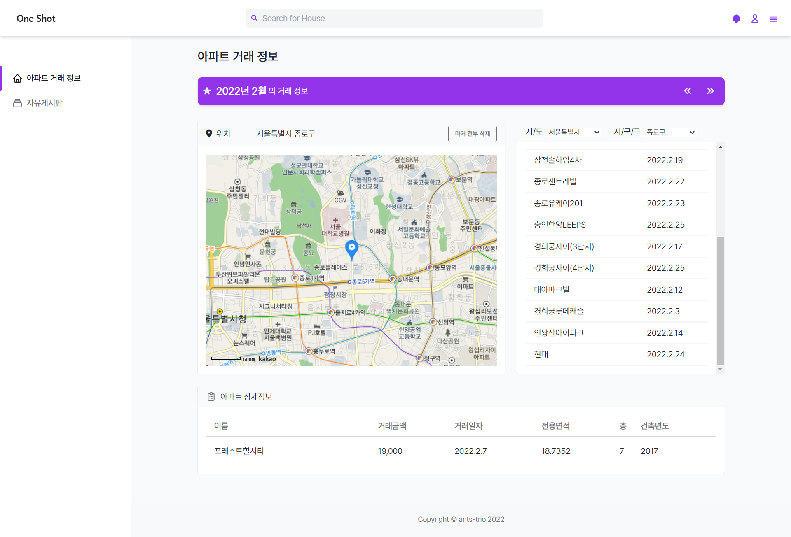
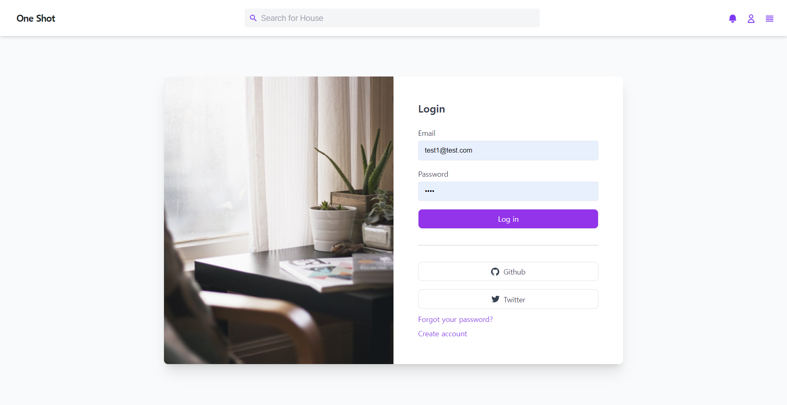
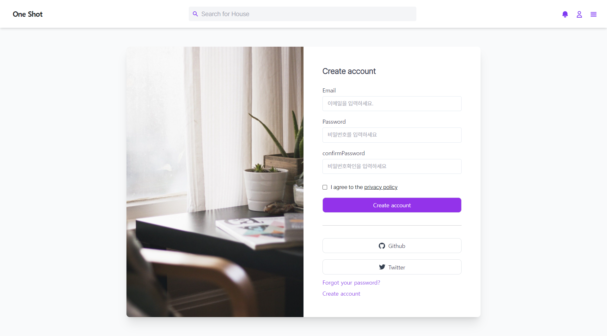
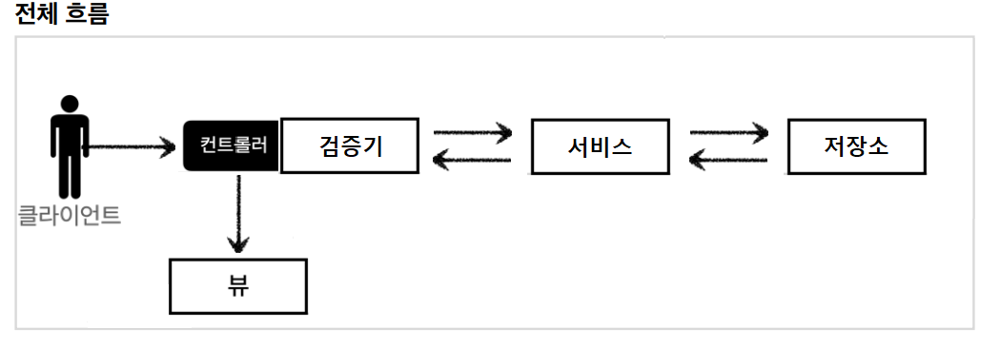
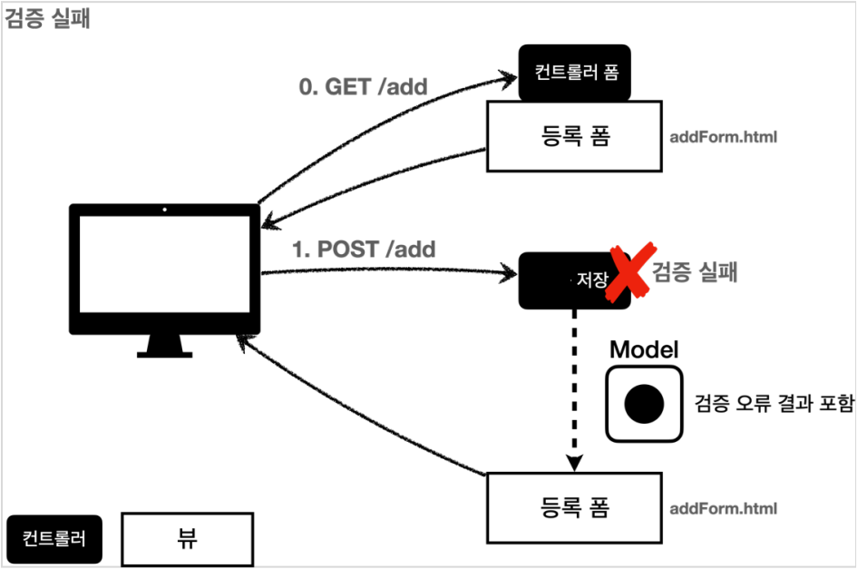
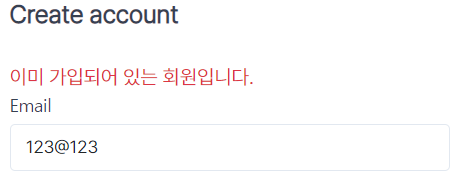
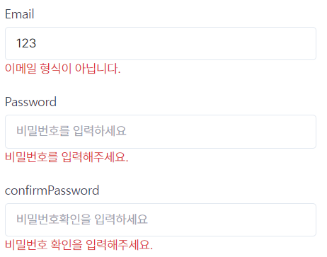

# OneShot

전국의 아파트 거래 정보를 날짜, 지역 별로 조회할 수 있는 웹 페이지 개발.

거래 정보 조회 외에도 회원가입, 로그인, 지역 북마크 추가, 아파트 위치 시각화, 마커 및 인포 윈도우 표시 등의 기능을 구현.


## 목차

1. 역할 분배 및 기여자
2. 기능구현
   1. Front-End
   2. Back-End


---


## 역할 분배 및 기여자

### Front-End

 **[강성엽](https://github.com/yyeopp)**, **[이수은](https://github.com/beeee2)**

- HTML5, CSS3, JavaScript, BootStrap4

### Back-End

**[임승민](https://github.com/winmini)**

- Java, Spring Framework, JPA, H2  


---


# 기능 구현

## Front-End

### 1. 초기화면



로그인 및 회원가입이 가능

2022년 2월을 초기 날짜로 지정

**Geolocation**과 연동하여 현재 위치에 지도를 위치시키고 마커를 표시

**지역 북마크 추가 버튼**이 로그인 전이므로 비활성화  

### 2. 로그인페이지




별도의 HTML로 구현

Back-End와 연동하여 **실제 로그인이 가능함**.  

### 3. 회원가입 페이지




별도의 HTML로 구현

**비밀번호 확인**에 대해 유효성 검증 구현

Back-End와 연동하여 **실제 회원가입이 가능**   

### 4. 로그인 이후


로그인 이후의 메인페이지를 별도 HTML로 구현

**북마크 추가 버튼** 활성화

**로그인, 회원가입 버튼 비활성화** 및 계정 관리 버튼 활성화   

### 5. 지역 검색


로딩과 동시에 **시/도** 정보를 로딩해 option으로 추가


**시/군/구** 에 대해 **더블 셀렉트** 기능을 구현: **AJAX 활용**

수원시 영통구, 성남시 분당구, 청주시 흥덕구와 같은 **예외 케이스에 대한 대응** 완료

**읍/면/동** 검색 기능은 의도적으로 배제

- 공공데이터의 **법정동** 카테고리는 실생활에서 거의 사용되지 않는 legacy에 가까움. 실제로는 **행정동**을 주로 사용하고 있으나 데이터에 포함되지 않음.

  - 예시로, 관악구는 행정동만 21개이지만 법정동은 단 3개

    반대로 종로구는 행정동이 17개이지만 법정동은 무려 87개

- 부동산 매물을 탐색하는 사용자의 입장에서 동 단위는 중요하지 않고, 검색 절차만 복잡하게 만들 뿐이라고 판단    

### 6. 북마크 기능


현재 선택한 지역을 **북마크로 추가**할 수 있음

- **DB와 연동**하여 사용자와 북마크 데이터를 연결함

이미 추가한 지역에 대해서는 북마크로 등록 불가하도록 **유효성 검증**

북마크를 통한 조회 및 북마크 삭제 기능 구현   

### 7. 상세정보 조회 및 지도 기능


지역 선택 완료 시, 

- 좌측 상단에 선택된 지역의 이름을 **지도의 제목**으로 출력

- 해당 시기 해당 지역의 **매물 간략정보**를 table 형식으로 조회

table의 **각 행을 클릭**할 시,

- 선택된 행임을 나타낼 수 있도록 행의 **css를 변경**하고

- 우측 하단에 해당 거래에 대한 **상세 정보를 출력**하며

- **지도**가 해당 매물의 위치로 이동하면서 마커를 생성

table의 행은 **다중 선택이 가능**하고, 마커도 다중으로 생성 가능


선택된 행을 다시 클릭할 시, **선택이 해제**됐음을 시각적으로 구현

- 지도에 표시된 **마커도 함께 제거**하도록 구현


같은 **시/도** 내에서는 **시/군/구**를 switch해도 지도 상의 마커를 유지하도록 의도

- **매물 탐색이 보통 시/도 단위**로 이루어짐을 감안함.

**시/도**를 switch할 시 선택 정보 및 지도 상 마커가 전부 초기화


지도 상의 마커를 클릭할 시, 해당 매물의 이름을 **인포윈도우**로 구현

- **removable**로 구현

**마커 전부 삭제** 버튼 클릭 시 모든 마커가 초기화됨   

### 8. 기간 검색


우측 상단의 버튼으로 **검색 기간을 변경**할 수 있음

- **AJAX**로 구현하여, 지역 선택이 완료된 이후라면 즉시 검색이 이루어짐

기간 변경 시 세부 정보 선택 여부나 마커는 **모두 초기화**   

----

## Back-End

개발하며 신경 쓴 부분들에 대해 기술합니다.

의존관계

### 1. 클린 코드

보다 깔끔한 코드를 작성하기 위하여 신경을 많이 썼습니다.

**lombok과 Spring 의 애노테이션 설계**

lombok과 Spring은 많은 어노테이션을 지원합니다. 자주 쓰이는 애노테이션들을 활용하여 이해하기 쉽고 지저분한 코드를 많이 생략할 수 있습니다.

- `@Data`, `@Getter`, `@Service`, `@RequiredArgsConstructor` 등등

예시코드

**MemberServiceImpl**

```java
@Service
@RequiredArgsConstructor
@Transactional(readOnly = true)
public class MemberServiceImpl implements MemberService {
      private final MemberRepository memberRepository;

      @Transactional
    @Override
    public Long join(Member member) {
        memberRepository.save(member);
        return member.getId();
    }

    ...
}
```

 final 변수는 생성자로 주입하거나 초기화로 주입할 수 있습니다. 생성자 주입을 위해 `@RequiredArgsConstructor` 를 사용하여 생성자 부분의 코드가 사라짐으로써 보다 깔끔한 코드가 탄생됩니다.

**LoginForm**

```java
@Data
public class LoginForm {

    @Email
    @NotEmpty
    private String email;

    @NotEmpty
    private String password;
}
```

`@Data` 애노테이션을 통해 getter와 setter를 코드에 집어넣지 않음으로 정말 깔끔한 코드가 완성됩니다.

**빌더 패턴**

Member 객체 같은경우 파라미터로 받아야 할 값들이 많습니다. 무작정 파라미터를 늘려 생성자로 확장하면 나중에 확장성도 떨어질 뿐더러 객체를 생성할 때 실수여지도 늘어나고, 가독성도 떨어집니다. 이를 방지하기 위해 파라미터가 조금 많아지는 부분은 빌더패턴을 적용하였습니다.

예시 코드

**Member**

```java
@Entity
@Getter
@NoArgsConstructor(access = PROTECTED)
public class Member {

    ...

    private Member(Builder builder) {
        name = builder.name;
        email = builder.email;
        password = builder.password;
    }

    @Override
    public String toString() {
        return "Member{" + "name='" + this.getEmail() + '\'' + '}';
    }

    public static class Builder {
        private Name name;
        private String email;
        private String password;

        public Builder name(Name name){
            this.name = name;
            return this;
        }

        public Builder email(String email) {
            this.email = email;
            return this;
        }

        public Builder password(String password) {
            this.password = password;
            return this;
        }

        public Member build() {
            return new Member(this);
        }
    }
}
```

이러한 빌더 패턴을 적용하면 멤버 객체를 생성할 때 다음과 같이 코드를 짤 수 있습니다.

```java
Member member = new Member.Builder()
  .name(name)
  .email(form.getEmail())
  .password(form.getPassword())
  .build();
```

그러면 파라미터마다 어떤 값을 넣어야 할지 명확하여 실수할 여지도 줄어들고, 파라미터가 늘어나도 확장성도 늘어납니다.


**전략 패턴**

뷰를 호출하는 컨트롤러에서 어떤 `form`의 입력을 받는다면, 무조건 다음과 같은 코드로 시작할 수 밖에 없습니다.

```java
if (bindingResult.hasErrors()) { // 타입 검증 체크
  return "{form을 호출한 html}";
}
// 논리적인 검증을 하는 코드
if (bindingResult.hasErrors()) { // 논리 검증 체크
  return "{form을 호출한 html}";
}
```

그리고 이는 중복된 코드입니다. 이 중복 코드를 어떻게 하면 제거할 수 있을까 고민을 했습니다. 내부적으로 숨기기 위해 전략패턴을 사용합니다.

```java
@Component
@RequiredArgsConstructor
public class ValidatorContext {

	private final Map<String, ValidatorStrategy> validatorStrategy;

	public void validate(Object form, BindingResult bindingResult, String strategy) {
		if (bindingResult.hasErrors()) {
			return;
		}
		validatorStrategy.get(strategy).call(form, bindingResult);
	}
}
```

context가 먼저 타입오류가 있는지 체크하고 있으면 검사를 종료합니다. 만약 없다면 끼워맞춘 전략을 찾아서 그를 호출해줍니다. 전략이 여러개일 수 있고 DI를 스프링에 맡기고 싶어, List가 아닌 Map을 이용하였습니다.

그 호출된 전략은 다음과 같이 검사를 이어서 진행합니다.

```java
@Override
public void call(Object form, BindingResult bindingResult) {
  if (form instanceof LoginForm) {
    validateEmailAndPassword((LoginForm)form, bindingResult);
    return;
  }
  throw new IllegalArgumentException();
}
```

그리고 전략 패턴을 사용하여 중복을 이용하는 코드는 다음과 같이 줄어듭니다.

```java
validatorContext.validate(form, bindingResult, LOGIN_STRATEGY);
if (bindingResult.hasErrors()) {
  return "member/login";
}
```

return문은 1번으로 줄어들었고, 검사는 내부적으로 진행됩니다. 넘겨주는 매개 변수가 3개인 것은 조금 아쉬운 부분이지만 그래도 깔끔하게 정리되었고 중복은 사라졌으므로 더 나은 코드가 된 것은 맞다고 생각합니다.


**객체와 메서드는 한가지 책임**

클래스도, 메서드도 한가지 책임을 담당하도록 최대한 설계하였습니다. 아직 리팩터링해야할 부분이 너무 많지만 그 중 일부만 예를 들어 보이겠습니다.

예시코드

```java
@PostMapping("/login")
public String login(@Validated @ModelAttribute("loginForm") LoginForm form,
                    BindingResult bindingResult,
                    HttpServletRequest request) {

  loginValidator.validate(form, bindingResult);

  if (bindingResult.hasErrors()) {
    return "member/login";
  }

  loginService.login(request, form.getEmail());
  return "redirect:/";
}
```

컨트롤러의 일부입니다. 외부에서 데이터가 컨트롤러로 넘어오면 먼저 데이터 검증을 마칩니다. 검증은 컨트롤러에게 역할을 맡기면 부담이 될 수 있기에, 역할을 검증기 객체에 넘깁니다. 그리고 검증이 된 데이터는 서비스에 데이터를 넘기고 뷰에 매핑하는 작업을 진행합니다. 검증기는 검증만, 컨트롤러는 컨트롤만, 서비스는 서비스만 진행됩니다.

또한 메서드들은 들여쓰기가 2줄이상 넘어가는 코드가 없어 이해하기가 더욱 쉽습니다.

**자바 8 스킬**

자바 8에는 lambda와 stream등 여러 스킬들이 나와 사용하면 코드를 클린하게 짤 수 있습니다. 그리고 추가된 메서드들을 활용하면 새로운 메서드를 짜지 않고 짤 수 있어 클린하며, 더 효율적인 코드로 구상이 가능합니다.

예시코드

```java
@Override
public Optional<Member> findOne(Long id) {
  return memberRepository.findById(id);
}
```

다음과 같은 Optional 객체는 null이 포함될 수 있다는 것을 명시함으로 null을 보완하기 위해 사용하는 클래스입니다. 자바 8에서 나온 클래스입니다. 이 Optional 객체는 꺼내는 쪽에서 어떻게 처리할지 생각할 수 있어 유연하며, 처리하지 않고 사용하려 하면 컴파일 오류로 사전에 문제를 방지할 수 있습니다.

```java
private void validateDuplicated(Member findMember, Area area) {
  findMember.getBookmarks()
    .stream()
    .filter(bookmark -> bookmark.getArea().equals(area))
    .findAny()
    .ifPresent(bookmark -> {
      throw new DuplicatedBookmarkException(DUPLICATED_BOOKMARK_MASSAGE);
    });
}
```

Optional 객체를 위와 같이 람다와 스트림도 섞어서 처리할 수 있습니다.

**상수 관리**

자주 사용해야 하는 상수는 하드 코딩을 피하고, 인터페이스를 통해 제공합니다. 

```java
public interface SessionConst {
    String LOGIN_MEMBER = "loginMember";
}
```

나중에 유지보수에 도움이 되며, 사용하는 입장에서도 이해하기 쉽습니다.

또한 error에 대한 메시지는 properties를 정의하여 관리합니다.

**errors.properties**

```properties
#==ObjectError==
alreadyRegistered=이미 가입되어 있는 회원입니다.
validateFail=아이디 또는 비밀번호가 맞지 않습니다.
wrongPassword=비밀번호가 일치하지 않습니다.


#==FieldError==
NotEmpty.email=이메일을 입력해주세요.
NotEmpty.password=비밀번호를 입력해주세요.

NotBlank=공백은 허용하지 않습니다.
```

이 역시 유지보수에 도움이 되고, 관리하기도 좋습니다.

**ArgumentResolver, 커스터마이징된 애너테이션**

```java
@Target(ElementType.PARAMETER)
@Retention(RetentionPolicy.RUNTIME)
public @interface LoginEmail {
}

@Slf4j
public class LoginMemberArgumentResolver implements HandlerMethodArgumentResolver {

    @Override
    public boolean supportsParameter(MethodParameter parameter) {
        boolean hasLoginAnnotation = parameter.hasParameterAnnotation(LoginEmail.class);
        boolean hasStringType = String.class.isAssignableFrom(parameter.getParameterType());

        return hasLoginAnnotation && hasStringType;
    }

    @Override
    public Object resolveArgument(MethodParameter parameter, ModelAndViewContainer mavContainer,
                                  NativeWebRequest webRequest, WebDataBinderFactory binderFactory) throws Exception {

        HttpServletRequest request = (HttpServletRequest)webRequest.getNativeRequest();
        HttpSession session = request.getSession(false);
        if (session == null) {
            return null;
        }
        return session.getAttribute(LOGIN_EMAIL);
    }
}
```

스프링의 ArgumentResolver를 상속 받아 좀 더 깔끔한 커스텀 애너테이션을 구현하였습니다. 이 애너테이션이 없다면 원래 구현해야 할 코드는 다음과 같지만,

```java
(@Validated @ModelAttribute("loginEmail") String loginEmail)
```

이 커스텀된 애너테이션을 이용하면 다음과 같이 줄일 수 있습니다.

```java
(@LoginEmail String loginEmail)
```

자주 사용해야 하는 애너테이션이기 때문에 가독성도 좋을 뿐더러 사용하기도 쉽습니다.

**내려가기 규칙 및 컨벤션 등**

그 외의 변수명, 네이밍 컨벤션, 메서드 순서등 

### 2. 프로젝트 구조 (V1)

#### 제일 많이 고민한 파트입니다.

프로젝트 구조는 MVC 구조를 채택하였습니다. 일단 기본적으로 정적 리소스의 HTML을 백엔드와 같이 적용하고 있기 때문에 다음과 같은 흐름이 진행됩니다. Spring의 내부적인 동작은 생략하였습니다. 특수상황이 아닌 일반적인 흐름입니다.



클라이언트가 요청을 보내면 컨트롤러에 오고, 컨트롤러는 검증기에서 데이터를 검증받습니다. 그리고 컨트롤러와 검증기는 서비스에 의존합니다. 서비스가 받은 데이터는 검증기에서 검증이 마친 데이터가 넘어왔으므로, 안심하고 서비스를 제공합니다. 필요한 데이터는 저장소(여기서는 H2)와 데이터를 주고 받으며, 반환해야할 데이터가 있다면 컨트롤러에 데이터를 반환해줍니다. 컨트롤러는 반환받은 데이터를 Spring이 제공하는 model객체에 담아 내부적인 뷰 리졸버를 통해 뷰를 호출합니다.

뷰는 받은 모델 객체를 렌더링 해야 한다면, 타임리프를 통하여 렌더링을 합니다.

만약 검증에 실패하는 경우라면?



컨트롤러가 지닌 검증기에서 검증에 실패하면, 바로 검증 오류 결과를 포함한 Model 객체를 html에 보내주고 타임리프를 통해 오류결과를 출력해서 보여줍니다. 회원가입에 이러한 기능이 들어가 있는데, 실제로 이미 가입한 회원을 다시 가입하려고 이메일을 입력하면 다음과 같은 화면을 출력합니다.



그 외에도 타입 검증에도 신경을 썼으며, 데이터 입력결과에 실패해도 기존의 데이터자체를 날리지 않습니다. 그럼 처음부터 다시 입력해야하는 사용자 입장에서 불편한 경험을 해야하기 때문입니다.



이러한 검증은 원래 프론트에서 먼저 진행되는 것이 맞으나, 프론트에서 검증했다고 서버에서 검증을 하지 않으면 안됩니다. 악의적으로 여전히 들어오는 방법은 많기 때문입니다.


### 2. 프로젝트 구조 (V2) 

개발하다보니 V1의 문제점이 너무 많이 생깁니다.

초창기 모델로, Service 객체는 입력데이터를 DTO로 받고, DTO를 내보내줍니다. 그리고  DTO는 Service 객체가 있는 패키지에 위치시키면 의존관계가 얽힐일이 없습니다. 초반에 이렇게 진행한 이유는 다음과 같습니다.


**보안적인 측면, 확장성**

엔티티가 서비스객체 바깥으로 노출될 일이 없기 때문에, 서비스 객체 바깥에서는 엔티티에 의존하는 일이 줄어들 것입니다. 이 말은 추후에 엔티티가 변경되어도 외부는 안에 있는 엔티티가 변경됐는지 알 수도 없고, 이어서 진행도 가능합니다.

그리고 엔티티는 중요한 정보가 포함되었을 가능성이 있기 때문에 절대로 외부로 노출하지 않기 위해 반환을 무조건 DTO로 하였습니다. 초반엔 괜찮았으나, 확장할수록 문제점이 생깁니다.


**숨겨져있는 의존관계로 인해 확장성이 오히려 떨어짐**

일단 입력으로 넣는 DTO는 그래도 괜찮은데, 되돌려주는 DTO는 해당 API가 쓰는 데이터만 넣는게 최선입니다. 그래야 쓸 데 없는 정보 유출을 방지할 수 있고 추후에 확장하기 좋습니다. 그래서 DTO에는 원하는 정보만 담는다고 하면 해당 메서드를 여러개만들어야 할 뿐더러, return타입만 다른 함수는 오버로딩조건이 아닌 컴파일 오류이기에 만들 수 없습니다. 함수이름만 바꾼다면 오히려 지저분해질 것입니다. 만약 새로운 함수가 DTO를 가져온다면, 그 새로운 함수가 필요로하는 정보를 다시 DTO에 넣어줘야 합니다. 이는 객체지향원칙에서도 벗어납니다. 새로운 함수를 만들었다고 기존에 있는 코드를 수정해야하기 때문입니다.

그리고 의존관계도 숨어져있습니다. API Controller가 쓰는 데이터를 Service가 그에 맞게 반환해주므로 Service가 Controller를 의존하고 있습니다.


때문에 입력은 DTO로 받지만, 반환은 엔티티로 변경하였습니다. 이렇게하면서 여러 장점이 생깁니다.

- 새로운 DTO로 입력을 받게 되어도, 오버로딩을 이용해서 같은 진행할 수 있다.
- 서비스는 이제 컨트롤러에 의존하지 않는다.
- 엔티티를 받은 객체는 다시 자기가 용도에 맞게 가공해서 가져다 쓰면 된다. 그리고 이게 오히려 객체지향적인 관점에서도 맞다. 그리고 이렇게 해야 확장성이 풍부해진다.
- 만약 MemberService라면 MemberRepository를 의존하겠지만 다른 어떤 Service가 Member에 대해 궁금하다해도 MemberRepository에 직접 접근하는 것이 아니라 MemberService를 통해 수행하면 중복코드도 말끔하게 사라지며, 의존도 깔끔해진다.


#### 검증의 구조

v1에서는 외부 데이터가 들어오면 1차적으로 검증을 마친 후, Service에 넘겨줬습니다. 이렇게 한 부분은, 잘못된 입력을 사전차단하기에 효과적이기 때문입니다. 그리고 검증된 데이터일테니 Service단에서는 이 넘겨받은 데이터를 편안하게 사용할 수 있다고 생각했습니다.


**치명적인 결함**

이 방법에는 숨겨져 있는 치명적인 결함이 몇가지 존재했습니다. 먼저 검증에는 2가지가 존재했습니다.

- 넘겨온 데이터 자체의 문제

예를 들면 숫자가 와야하는데 한글이 온 경우, 같이 데이터 자체의 문제가 있는 경우가 있습니다. 이 때는 그래도 괜찮습니다. binding을 통해 바로 처리가 가능합니다. 

- 우리 로직상에서의 문제

이 문제를 해결할 방법이 2가지인데, 하나는 검증기에서 처리하는 것과 하나는 서비스단에서 처리하는 것입니다. 검증기에서 처리한다면 객체지향적인 측면에서 맞다고 여겨집니다. 만약 서비스에서 검증을 한다면 검증기에서도 검증하고 서비스에서도 검증하는데 그럼 검증기를 없애고 서비스에서 한꺼번에 검증하는게 낫다고 생각하여 검증기로 넘겨주었습니다. 하지만 이 방법도 문제가 존재했습니다.

초창기에는 Service에서 엔티티를 반환해주지 않으므로 Repository를 의존했습니다. 일단 이 부분도 굉장히 신경이 쓰였는데, Serivce가 엔티티를 반환해주면서 어느 정도 괜찮아진 것 처럼 보였습니다. 또한 시작하면서 진행되는 부분도 템플릿 메서드를 통해 중복도 많이 제거가 가능했습니다.

**더 큰 문제**

Service를 의존하더라도 결국, 데이터를 가져온다는 것은 query를 날리는 작업입니다. JPA기술을 사용하고 있으므로, 영속성컨텍스트가 DB커넥션을 들고왔을 것입니다. 초창기에는 OSIV옵션을 키고 있었지만, 끄고 연습해보기로 하였습니다. 그러면 2가지가 가능해지는데 Validator가 트랜잭션 안에서 수행되거나 트랜잭션밖에서 수행되거나, 하지만 후자는 불가능하므로 전자여야만 합니다.

그러면 Validator가 Service를 호출하면서 그 트랜잭션 안에서 수행되고 빠져나올텐데, 그러면 그 때 디비 커넥션을 연결했다가 커넥션을 끊습니다. 그리고 다시 검증이 마치고 검증이 성공하면 서비스로 들어가면서 다시 트랜잭션이 수행되면서, 커넥션을 연결하고 다시 커넥션을 끊습니다.

의도치 않게 커넥션을 2번이나 해야합니다. 이 비용은 작은 비용이 아니기 때문에 큰 결함이라고할 수 있습니다.


**추가 고민**

과연 검증기가 모두 검증하는 것이 객체지향적인 관점에서 맞을까 생각해보면, 이 부분도 고민입니다. Service가 우리 로직을 수행해주는 객체인데..


#### 결론적으로..

초반에는 안전을 위해서였지만, 객체지향적, 성능등 여러 이슈로 서비스에서 검증을 수행합니다. 대신 서비스의 시작지점에서 검증을 수행한다면 위의 문제를 해결할 수 있습니다. 넘어온 데이터를 바로바로 검증하고 시작한다면 다시 안전하게 사용이 가능하며 커넥션도 한번의 연결로 문제를 해결할 수 있습니다. 때문에 구조를 변경하였습니다.


#### 학습을 위해

HTTP API설계의 부분에서 더 이상 검증기는 존재하지 않습니다. 문제 파악이나 문제 해결 로직 역시 Service객체에 들어가도 큰 문제가 없을 것이라 판단하여 검증기를 없앴습니다. 다만 뷰를 호출하는 부분에서의 검증기는 남아있습니다. 이 역시 없앨까 고민했지만, 없애지 않은 이유가 2가지 있습니다.

1. 학습을 위해

구조를 고민하여 변경하는 과정의 일부도 학습의 일부라서 지우지 않았습니다.

2. 무조건 적인 bindingResult

들어온 잘못된 값(타입이 잘못된 기본적인 에러) bindingResult으로 넣어 뷰에 넘겨주어야 하는 로직이 필수적입니다. 따라서 이 부분이 모두 중복될 수 밖에 없습니다. 중복은 보기 좋지 않아 여기서 검증과정을 거칩니다. binding검사도 하고, 논리적인 검증도 합니다. 이를 검증기에 활용하여 진행합니다. 검증기에서 내부적으로 검사를 모두 실시한 후 뷰를 호출합니다. 여기서 클린한 코드를 유지하기 위해 전략 패턴을 이용하였습니다.


### 3. HTTP API

REST API에 대해서 깊이 있는 공부가 부족하여 HTTP API로 대신합니다. 추 후에 공부하고 개선할 예정입니다. 에러 핸들러까지 추가하여 예외메시지를 지저분하게 반환하지 않아 보안적인 측면을 돕습니다.

#### Bookmark

- URI: `localhost/bookmark/new`
- METHOD: GET
- 설명: 북마크 추가하기
- 쿼리스트링: `city: String(시/도), region: String(시/군/구)`
- 예시: `/bookmark/new?city=서울&region=관악구`
- **성공 Response**

```java
{
    "state": "SUCCESS",
    "data": {
        "bookmarkId": 67
    }
}
```

- **실패 Response**

잘못된 입력(400 ERROR)

- 빈 입력값, 쿼리값을 잘못 넣는 경우 등

```java
{
    "state": "FAIL",
    "message": "[ERROR] 잘못된 입력입니다."
}
```

- 이미 존재하는 북마크를 넣는 경우

```java
{
    "state": "FAIL",
    "message": "[ERROR] 이미 존재하는 북마크입니다."
}
```

로그인을 하지 않은 경우(401 ERROR)

```java
{
    "state": "FAIL",
    "message": "[ERROR] 로그인이 필요합니다."
}
```

메서드를 잘못 사용한 경우(400 ERROR)

```java
{
    "state": "FAIL",
    "message": "[ERROR] 해당 메서드는 지원하지 않습니다."
}
```


### 4. 그 외

- 객체지향 원칙, SOLID 원칙을 준수하도록 신경썼습니다.
- 세션을 통하여 회원을 검증합니다.
- 인터셉터를 활용하여 로그인되지 않은 사용자가 로그인이 필요한 URI에 접근하려 하면, 접근을 제한합니다.
