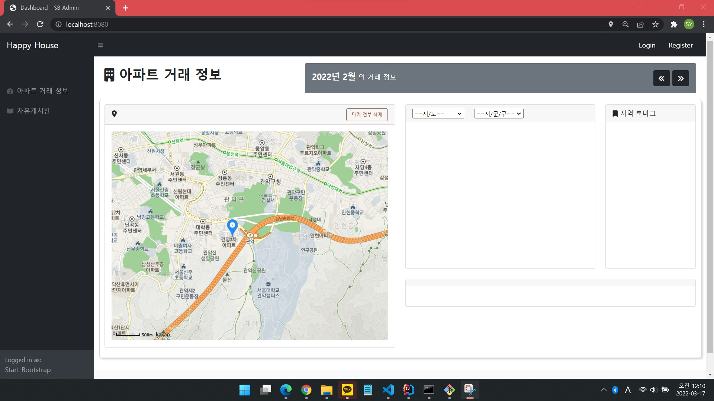
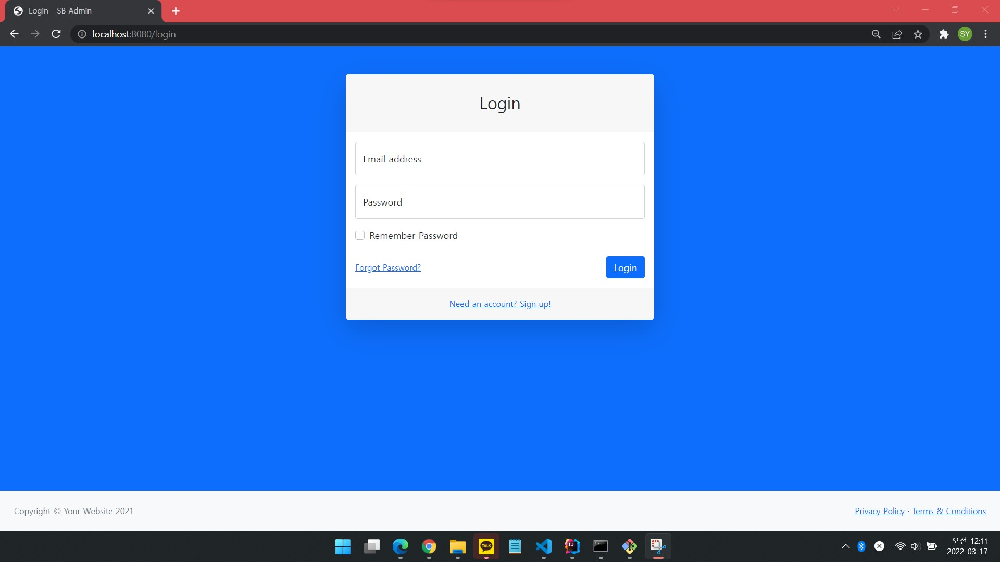
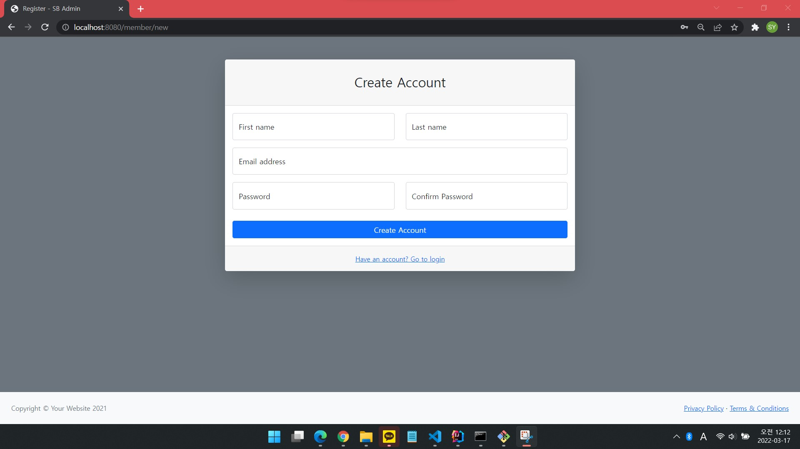
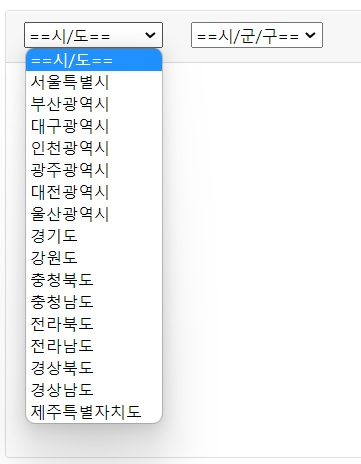
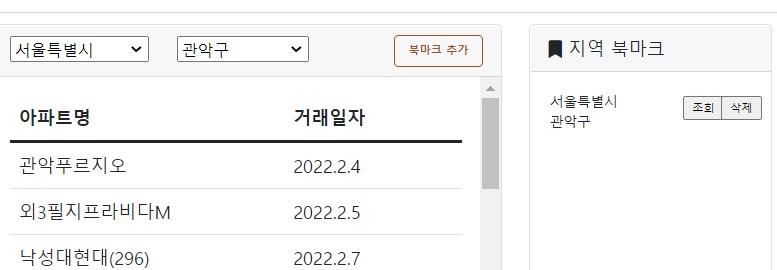
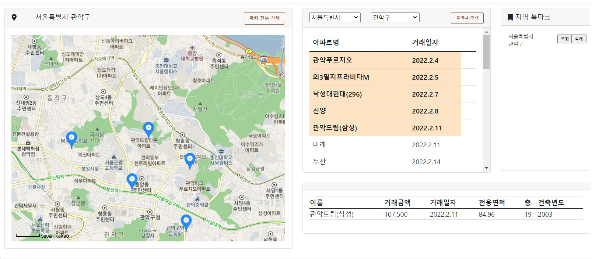
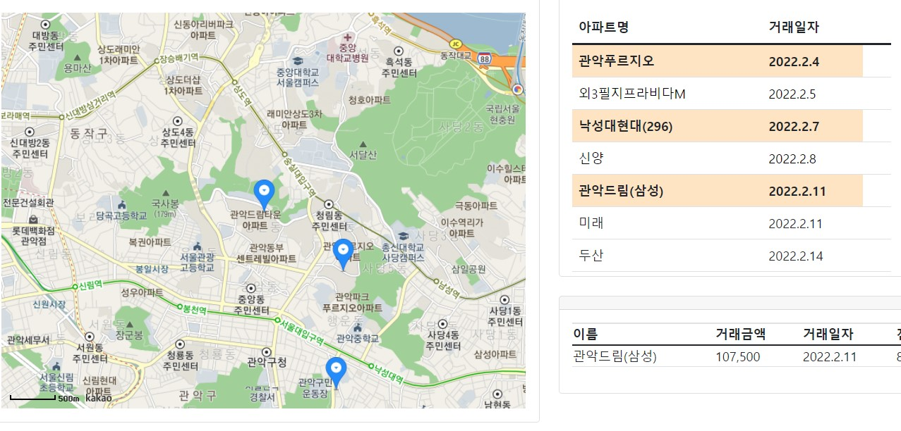
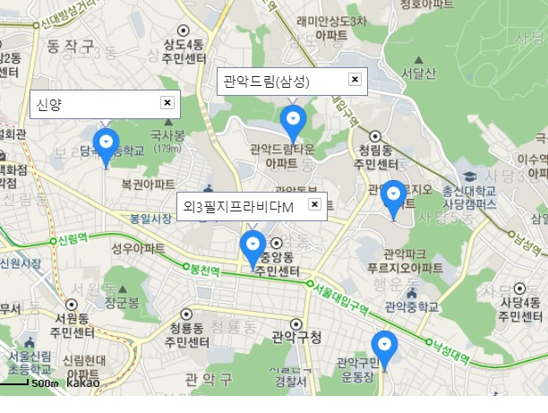

# HappyHouse

## 개요

- 전국의 아파트 거래 정보를 날짜, 지역 별로 조회할 수 있는 웹 페이지

- 거래정보 조회 외에도 회원가입, 로그인, 지역 북마크 추가, 아파트 위치 시각화, 마커 및 인포윈도우 표시 등의 기능을 구현.

## 역할 분배 및 기여자

### Front-End

- **강성엽**, **이수은**
  
  - HTML5, CSS3, JavaScript

### Back-End

- **임승민**
  
  - Java, Spring Framework, JPA, H2
  
  

## 기능 구현

### Front-End

#### 1. 초기화면

- 로그인 및 회원가입이 가능

- 2022년 2월을 초기 날짜로 지정

- Geolocation과 연동하여 현재 위치에 지도를 위치시키고 마커를 표시

- **지역 북마크 추가 버튼**이 로그인 전이므로 비활성화

#### 2. 로그인페이지

- 별도의 HTML로 구현

- Back-End와 연동하여 실제 로그인 기능을 구현

#### 3. 회원가입 페이지

- 별도의 HTML로 구현

- 비밀번호 확인에 대해 유효성 검증 구현

- Back-End와 연동하여 실제 회원가입이 가능

#### 4. 로그인 이후

- 로그인 이후의 메인페이지를 별도 HTML로 구현

- 북마크 추가 버튼 활성화

- 로그인, 회원가입 버튼 비활성화 및 계정 관리 버튼 활성화

#### 5. 지역 검색

- 로딩과 동시에 **시/도** 정보를 로딩해 option으로 추가

- **시/군/구**에 대해 **더블 셀렉트** 기능을 구현: AJAX 활용
  
  - 수원시 영통구, 성남시 분당구, 청주시 흥덕구와 같은 예외 케이스에 대한 대응 완료

- **읍/면/동** 검색 기능은 의도적으로 배제
  
  - 공공데이터의 **법정동** 카테고리는 실생활에서 거의 사용되지 않는 legacy에 가까움. 실제로는 **행정동**을 주로 사용하고 있으나 데이터에 포함되지 않음.
    
    - 예시로, 관악구는 행정동만 21개이지만 법정동은 단 3개
      
      반대로 종로구는 행정동이 17개이지만 법정동은 무려 48개
  
  - 부동산 매물을 탐색하는 사용자의 입장에서 동 단위는 중요하지 않고, 검색 절차만 복잡하게 만들 뿐이라고 판단

#### 6. 북마크 기능

- 현재 선택한 지역을 북마크로 추가할 수 있음
  
  - DB와 연동하여 사용자와 북마크 데이터를 연결함

- 이미 추가한 지역에 대해서는 북마크로 등록 불가하도록 유효성 검증

- 북마크를 통한 조회 및 북마크 삭제 기능 구현

#### 7. 상세정보 조회 및 지도 기능

- 지역 선택 완료 시, 
  
  - 좌측 상단에 선택된 지역의 이름을 지도의 제목으로 출력
  
  - 해당 시기 해당 지역의 매물 간략정보를 table 형식으로 조회

- table의 각 행을 클릭할 시,
  
  - 선택된 행임을 나타낼 수 있도록 행의 css를 변경하고
  
  - 우측 하단에 해당 거래에 대한 상세 정보를 출력하며
  
  - 지도가 해당 매물의 위치로 이동하면서 마커를 생성

- table의 행은 다중 선택이 가능하고, 마커도 다중으로 생성 가능

- 선택된 행을 다시 클릭할 시, 선택이 해제됐음을 시각적으로 구현
  
  - 지도에 표시된 마커도 함께 제거하도록 구현

- 같은 **시/도** 내에서는 **시/군/구**를 switch해도 지도 상의 마커를 유지하도록 의도
  
  - 매물 탐색이 보통 시/도 단위로 이루어짐을 감안함.

- **시/도**를 switch할 시 선택 정보 및 지도 상 마커가 전부 초기화

- 지도 상의 마커를 클릭할 시, 해당 매물의 이름을 인포윈도우로 구현
  
  - removable로 구현

- **마커 전부 삭제** 버튼 클릭 시 모든 마커가 초기화됨

#### 8. 기간 검색

- 우측 상단의 버튼으로 검색 기간을 변경할 수 있음
  
  - AJAX로 구현
